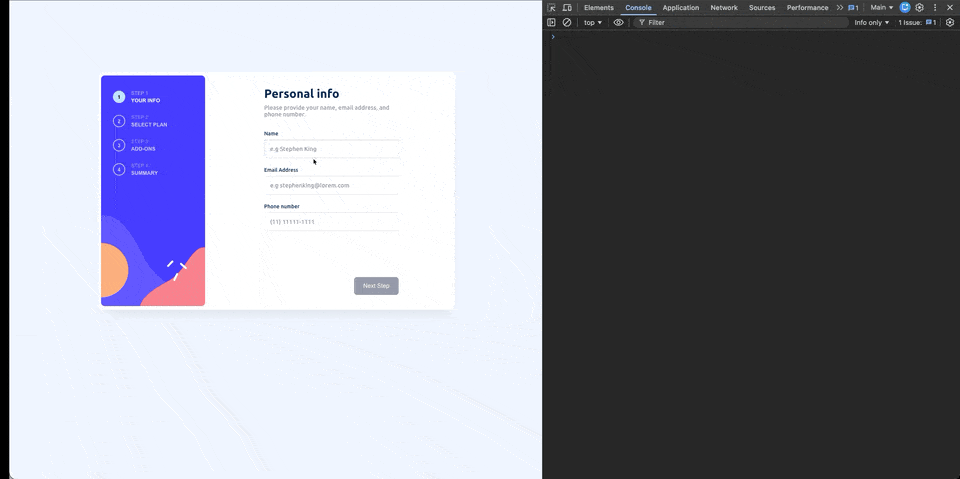
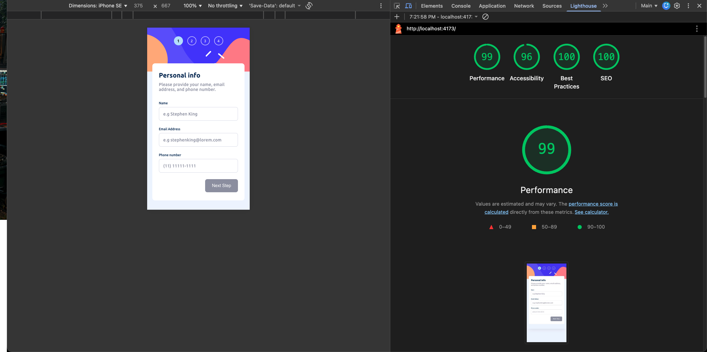

# Multi Step Form

A multi-step form application developed with a strong focus on accessibility, performance, and custom validation.

## 🎬 Demo



## 🎨 About the Project

**Multi Step Form** is a web application that guides the user through a registration process in steps. The project was built to offer a smooth and intuitive user experience, with real-time validation and clear visual feedback.

The main highlight of this project is that **I did not use external libraries for form management** (like Formik or React Hook Form). All the logic for state, validation, and navigation between steps was implemented using **Custom Hooks**.

This was an intentional architectural decision to:
*   **Avoid "bundle bloat"**: Keeping the application light and fast.
*   **Have full control**: Managing the logic exactly as needed without dependencies.

## ✨ Features

-   **100% Accessibility**: The application follows WCAG guidelines strictly.
    -   Correct use of `aria-labels`, `aria-roles`, and semantic attributes.
    -   Full keyboard navigation.
-   **Custom Validation**: I created my own hooks to validate each input field. This ensures correct data without using heavy libraries.
-   **Responsive Design**: The layout adapts perfectly to desktops, tablets, and mobile devices.
-   **Top Performance**: Optimized to reach the maximum score on Lighthouse.

## 📊 Performance and SEO (Lighthouse)

The project achieved excellent scores on Google Lighthouse (100/100). This proves the commitment to performance and SEO quality.

### Desktop


### Mobile



## 🛠️ Technologies

This project was developed using modern React technologies, keeping external dependencies to a minimum:

-   **React**
-   **TypeScript**
-   **Styled Components**
-   **Vite**

> **Note:** No form management libraries or UI component libraries (like Material UI or Bootstrap) were used. Everything was built from scratch using specific hooks for each validation.

## 🚀 How to Run the Project

### Prerequisites

-   Node.js (version 14 or higher)
-   npm or yarn

### Installation

1. Clone the repository:

```bash
git clone https://github.com/orafael93/substep-form.git
cd substep-form-frontend-mentor
```

2. Install dependencies:

```bash
npm install
```

### Development

To run the project in development mode:

```bash
npm run dev
```

The project will open automatically in your browser (usually at `http://localhost:5173`).

### Build for Production

To generate the optimized bundle for production:

```bash
npm run build
```

The optimized files will be generated in the `dist/` folder.

## 👨‍💻 Author

**Rafael**

-   Email: orafaeldev@gmail.com
-   GitHub: [@orafael93](https://github.com/orafael93)
